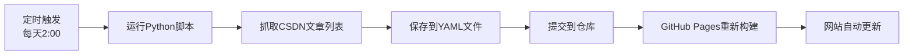

# 🤖 CSDN博客自动同步方案

## 📋 方案说明

本方案实现了**轻量级的CSDN博客自动同步**功能，通过GitHub Actions定时任务自动抓取您的CSDN博客文章列表，并在Blog Posts页面展示。

### ✨ 主要特点

- ✅ **完全自动化**：每天自动抓取，无需手动维护
- ✅ **轻量级**：只抓取文章列表（标题、链接、日期、摘要），点击跳转到CSDN原文
- ✅ **保留精选**：_posts目录可继续用于精选文章
- ✅ **美观设计**：现代化卡片式布局，响应式设计
- ✅ **无侵入性**：不影响现有功能

---

## 📂 项目结构

```
Lvyizhuo.github.io/
├── .github/workflows/
│   └── sync-csdn-blog.yml          # GitHub Actions工作流（每天自动运行）
├── scripts/
│   ├── fetch_csdn_articles.py      # Python爬虫脚本（抓取CSDN文章）
│   └── test_sync.sh                # 本地测试脚本
├── _data/
│   └── csdn_posts.yml              # 存储抓取的文章数据
└── _pages/
    └── year-archive.html           # Blog Posts页面（已更新）
```

---

## 🚀 使用指南

### 1️⃣ 本地测试（可选）

在提交到GitHub之前，您可以先在本地测试：

```bash
# 进入项目目录
cd /home/lyz-ubuntu/Project/Lvyizhuo.github.io

# 赋予执行权限
chmod +x scripts/test_sync.sh

# 运行测试
./scripts/test_sync.sh
```

测试成功后，会在 `_data/csdn_posts.yml` 中看到抓取的文章数据。

### 2️⃣ 提交到GitHub

```bash
# 添加所有新文件
git add .github/workflows/sync-csdn-blog.yml
git add scripts/fetch_csdn_articles.py
git add scripts/test_sync.sh
git add _data/csdn_posts.yml
git add _pages/year-archive.html

# 提交更改
git commit -m "✨ Add CSDN blog auto-sync feature"

# 推送到GitHub
git push origin main
```

### 3️⃣ 手动触发同步（首次使用）

1. 打开GitHub仓库页面
2. 点击 **Actions** 标签
3. 选择 **Sync CSDN Blog Articles** 工作流
4. 点击 **Run workflow** 按钮
5. 等待几秒钟，工作流完成后会自动提交更新

### 4️⃣ 查看效果

访问：https://Lvyizhuo.github.io/year-archive/

---

## ⚙️ 工作原理



### 自动化流程

1. **定时任务**：每天凌晨2点（UTC时间）自动运行
2. **抓取文章**：Python脚本访问您的CSDN博客，抓取文章列表
3. **保存数据**：将文章信息保存到 `_data/csdn_posts.yml`
4. **自动提交**：如果有新文章，自动提交更改
5. **网站更新**：GitHub Pages自动重新构建并发布

---

## 📝 配置说明

### 修改同步频率

编辑 `.github/workflows/sync-csdn-blog.yml`：

```yaml
on:
  schedule:
    # 当前：每天凌晨2点（UTC）
    - cron: '0 2 * * *'
    
    # 改为每12小时一次：
    # - cron: '0 */12 * * *'
    
    # 改为每周一次：
    # - cron: '0 2 * * 0'
```

### 修改抓取数量

编辑 `scripts/fetch_csdn_articles.py`：

```python
# 第98行，修改max_pages参数
articles = fetch_article_list(max_pages=10)  # 改为需要的页数
```

---

## 🎨 页面效果

Blog Posts页面现在包含：

1. **CSDN博客区域**（主要）
   - 精美的头部横幅
   - 文章统计信息
   - 卡片式文章列表
   - 外部链接标识

2. **精选文章区域**（可选）
   - 显示 `_posts/` 目录中的本地文章
   - 用于展示重点文章

---

## 🔧 维护说明

### 如果抓取失败

1. 检查CSDN是否更新了页面结构
2. 查看GitHub Actions运行日志
3. 必要时更新 `scripts/fetch_csdn_articles.py` 中的选择器

### 手动运行同步

```bash
# 在本地运行
python3 scripts/fetch_csdn_articles.py

# 或使用测试脚本
./scripts/test_sync.sh
```

### 查看同步日志

1. 访问：https://github.com/Lvyizhuo/Lvyizhuo.github.io/actions
2. 点击最新的 "Sync CSDN Blog Articles" 运行记录
3. 查看详细日志

---

## 📌 注意事项

1. **首次运行**：需要手动触发一次GitHub Actions
2. **数据更新**：每次同步会覆盖 `_data/csdn_posts.yml`
3. **本地文章**：`_posts/` 目录中的文章仍会在"精选文章"区域显示
4. **链接跳转**：所有CSDN文章点击后会在新标签页打开
5. **网络限制**：如果CSDN限制访问频率，可能需要调整同步频率

---

## 🎯 下一步优化（可选）

- [ ] 添加文章分类/标签过滤
- [ ] 支持文章搜索功能
- [ ] 添加RSS订阅功能
- [ ] 同步文章评论数、点赞数
- [ ] 支持多个博客平台（知乎、掘金等）

---

## 📞 技术支持

如遇问题，请：
1. 查看GitHub Actions运行日志
2. 检查 `_data/csdn_posts.yml` 文件内容
3. 确认CSDN博客URL是否正确

---

**配置完成！现在您的Blog Posts页面会自动展示CSDN博客内容了！** 🎉
