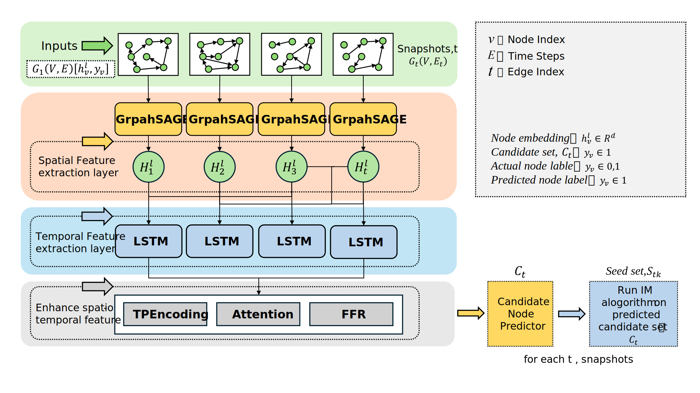

# **基于智慧家庭多维信息的动态社交网络快照分析及种子节点预测方法**

## 技术领域

本发明涉及社交网络分析技术领域，具体涉及一种基于智慧家庭多维信息的动态社交网络快照分析及种子节点预测方法

## 背景技术

影响力最大化（Influence Maximization, IM）是网络科学与数据挖掘领域的关键问题。旨在网络中选择少量“种子”节点以最大化信息传播范围。现有算法多为静态网络设计，部分基于图神经网络的方法虽能处理简单演化，但难以应对真实世界的高度动态系统。在智慧家庭等新兴场景中，此局限性尤为突出。智慧家庭网络由大量异构物联网设备组成，其拓扑、节点状态及连接关系因用户交互与环境变化而持续高速演进。其核心挑战在于，网络演化由多维信息感知驱动：节点的属性及节点间的影响力不再是静态标量，而是由位置、设备工况、网络带宽等多维实时信息动态决定的复杂状态。现有方法无法有效建模这种由多维信息感知驱动的复杂动态性，导致在执行如指令下发、安全预警等任务时，种子选择策略的准确性和时效性大打折扣。因此，急需一种能融合多维感知信息、并能适应高度动态网络的全新影响力最大化技术，以解决当前面临的挑战。

## 发明内容

为了克服传统影响力最大化算法在动态网络下的局限性，本发明提供了一种有效的动态网络快照分析技术和候选种子节点预测方法，通过动态社交网络快照分析技术和时空神经网络模型实现精准的候选种子节点预测。该方法首先采用一种自适应快照分析技术对社交网络进行动态建模，使用高效的动态启发式（TIFC）方法为节点预训练标签，通过DynGNN-AttLSTM模型提取节点的空间特征和时序特征，并基于正余弦位置编码为时空特征添加位置信息。随后，设计一个多头时间注意力机制模块捕获节点在动态网络中的长期影响力状态；最后，节点的多尺度时空特征经过层归一化和FFN处理完成特征融合后被送入分类器，从而预测出动态社交网络中的候选种子节点。

本发明克服其技术问题所采用的技术方案是：

1.一种基于智慧家庭多维信息的动态社交网络快照分析及种子节点预测方法，其特征在于，包括如下步骤：

a）构建时序快照生成器，将动态社交网络数据集$[SRC,TGT,TS]$输入到自适应快照快照生成器中，基于事件数阈值与时间长度约束进行窗口划分，若窗口内累计事件数$N_{events}(t_s, t_i)$ 大于目标事件阈值$\theta_{events}$且$\Delta t \geq d_{min}$，或$\Delta t > d_{max}$时触发切窗，生成动态网络序列$G_1,G_2,G_3,...,G_t$。

b）使用动态启发式TIFC方法进行预训练标注，计算动态网络序列$G_1,G_2,G_3,...,G_n$中节点的TIFC分数和空间特征$[F_s^1,\:F_s^2,\:F_s^3,\:F_s^4,F_s^5,\:F_s^6,\:F_s^7,\:F_s^8,F_s^9]$，将得分前$\tau\%$的节点$s_1,s_2,s_3,...,s_k$标记为有影响力的节点。

c）构建DynGNN-AttLSTM网络，加载快照序列对时间窗口内所有快照的特征$[F_s^1,\:F_s^2,\:F_s^3,\:F_s^4,F_s^5,\:F_s^6,\:F_s^7,\:F_s^8,F_s^9]$进行对堆叠，利用LSTM层提取节点时序信息，并使用正余弦时间编码为快照添加位置信息，得到融合了空间结构、时序依赖和时间位置的特征向量。

d）构建时空交叉注意力融合模块，将提取的融合特征向量$V$经过残差连接、层归一化、FFN进一步提炼特征，得到最终融合特征$F$。

e）构建候选种子节点分类器，将增强后的时序特征$F$输入分类器，输出二分类的$logits$，从而预测出每张快照中的候选种子节点。

f）最终通过贪心算法选择出包含有$k$个种子的集合$S_k$。

2.根据权力要求1所述的基于智慧家庭多维信息的动态社交网络快照分析及种子节点预测方法，其特征在于，步骤a）包括如下步骤：

a-1）时序快照生成器包含多个子模块，其中包括数据处理模块、窗口切分模块（可选自适应模式和固定模型）、时间衰减模块（可选加权模式和二进制模式，扩散模拟支持边权）。

a-2）使用数据处理模块读取输入数据文件$[SRC,TGT,TS]$（含源节点、目标节点、时间戳三要素），转换为结构化数据格式。将时间戳（秒级）转换为标准日期时间格式，为后续时间窗口划分提供基础。

a-3）对数据按时间戳升序排序后，进行自适应动态划分窗口：设窗口起始时间为 $t_s$，当前考察事件索引为 $i$​，则当以下条件之一满足时触发切窗：
$$
\begin{cases} N_{events}(t_s, t_i) \geq \theta_{events}, \quad \text{且 } \Delta t \geq d_{min} \\ \Delta t > d_{max} \end{cases}
$$
其中： $N_{events}(t_s, t_i)$ 表示窗口内累计事件数；$\theta_{events}$ 为目标事件阈值；$d_{min}, d_{max}$ 分别为最小和最大允许天数。 

a-4）将节点编号归一化，计算数据中源节点与目标节点的最小编号，对所有节点编号进行偏移修正，使节点编号从 0 开始连续递增，确保节点标识的统一性与连续性。

a-5）构建动态网络序列，并将其保存为快照格式文件。

3.根据权力要求1所述的基于智慧家庭多维信息的动态社交网络快照分析及种子节点预测方法，其特征在于，步骤b）包括如下步骤：

b-1）使用基于启发式的动态影响力容量（TIFC）计算方法对数据进行标注，其主要由数据加载模块、TIFC计算模块（包括动态局部影响力、动态全局影响力、动态边传播概率的时间平滑度）、特征计算模块和标签生成模块构成。

b-2）使用数据加载模块载入动态网络快照序列 $\{G_t=(V_t,E_t,W_t)\}_{t=1}^T$。

其中：$V_t$ 为节点集合，$E_t\subseteq V_t\times V_t$ 为有向或无向边集合； $W_t=\{w_{uv}(t)\mid (u,v)\in E_t\}$ 为边权（交互强度）。无权网络默认 $w_{uv}(t)=1$；$N_t(u)$ 为节点 $u$ 在 $t$ 时刻的一阶邻居集合，$D_t(u)=|N_t(u)|$ 为其度； $k_{c,t}(u)$ 为 $t$ 时刻的 k-core coreness。定义传播概率公式为：
$$
P_t(u,v) := w_{uv}(t)\,\big(1-p_s(v,t)\big),
$$
其中 $p_s(v,t)\in[0,1]$ 为节点 $v$ 在时刻 $t$ 的自激活概率；若未知，默认 $p_s(v,t)=0$。 

b-3）计算动态边传播概率的时间平滑度， 通过引入指数加权移动平均（EWMA）得到：
$$
\widetilde{P}_t(u,v)=\beta\,\widetilde{P}_{t-1}(u,v)+(1-\beta)\,P_t(u,v),\quad \beta\in[0,1).
$$
首帧初始化 $\widetilde{P}_1=P_1$。$\beta$ 越小越强调最新边；越大越平稳。对不存在的历史边将 $\widetilde{P}_{t-1}=0$。

b-4）计算动态局部影响力，采用两跳截断并对每个节点仅保留 Top-L 最强邻居进行（按 $\widetilde{P}_t(u,\cdot)$​ 排序）： 
$$
\begin{aligned} I_L^{\mathrm{dyn}}(u,t) &= 1 + \sum_{v\in N_t^{(L)}(u)} \widetilde{P}_t(u,v)    + \sum_{v\in N_t^{(L)}(u)}\sum_{z\in N_t^{(L)}(v)}       \widetilde{P}_t(u,v)\,\widetilde{P}_t(v,z), \end{aligned} 
$$
其中 $N_t^{(L)}(x)$ 表示按 $\widetilde{P}_t(x,\cdot)$ 取前 $L$ 个邻居。式(4)在一跳与二跳层面近似扩散路径的叠加贡献，能够快速反映当下高通量传播通道。

b-5）计算动态全局影响力，对度与 coreness 进行时间平滑：
$$
\overline{D}_t(u)=\rho\,\overline{D}_{t-1}(u)+(1-\rho)\,D_t(u),\quad \overline{k}_{c,t}(u)=\rho\,\overline{k}_{c,t-1}(u)+(1-\rho)\,k_{c,t}(u),\quad \rho\in[0,1). 
$$
定义新邻居率以刻画结构涌现性：
$$
\nu_t(u)=\frac{|\,N_t(u)\setminus N_{t-1}(u)\,|}{D_t(u)+\varepsilon},\quad \varepsilon>0. 
$$
则全局项定义为：
$$
I_G^{\mathrm{dyn}}(u,t)=\overline{k}_{c,t}(u)\left(1+\frac{\overline{D}_t(u)}{D_{N,t}}\right)\Big(1+\eta\,\nu_t(u)\Big), \quad D_{N,t}=\max_{x\in V_t} D_t(x),\ \eta\in[0,1]. 
$$
上式通过平滑 coreness/度抑制偶然波动，并对新边涌入的节点给予线性加成，提前识别出正在崛起的中心。 

b-6）TIFC综合得分和归一化，对局部项与全局项分别做帧内最大值归一化，并乘性融合：
$$
I^{\mathrm{dyn}}(u,t)= \frac{I_L^{\mathrm{dyn}}(u,t)}{\max_{x\in V_t} I_L^{\mathrm{dyn}}(x,t)}\cdot \frac{I_G^{\mathrm{dyn}}(u,t)}{\max_{x\in V_t} I_G^{\mathrm{dyn}}(x,t)}\cdot R_t(u), 
$$
b-7）特征计算模块为快照中每个节点计算特征，包括5个静态特征（度、介数中心性、k-核数、平均邻居度、动态TIFC分数）和4个动态特征（度变化量、IFC变化量、新邻居比例、TIFC波动系数）。

度数计算方式：$degree(v) = $ 与节点 $v$ 直接相连的边的数量；介数中心性计算公式：
$$
   C_B(v) = \sum_{s \neq v \neq t} \frac{\sigma_{st}(v)}{\sigma_{st}}
$$
其中：$\sigma_{st}$ 是从节点 $s$ 到节点 $t$ 的最短路径总数，$\sigma_{st}(v)$ 是经过节点 $v$ 的最短路径数量。

k-核数的计算公式：$k\_core(v) = $ 节点 $v$ 所属的最大k核中的k值；平均邻居度计算公式：
$$
   \bar{k}(v) = \frac{1}{deg(v)} \sum_{u \in N(v)} deg(u)
$$
其中：$N(v)$ 是节点 $v$ 的邻居集合，$deg(v)$ 是节点 $v$ 的度

动态TIFC计算公式：见b-6）；度变化量计算法公式：

$$
   \Delta degree(u) = degree_{now}(u) - \bar{D}_{prev}(u)
$$
其中：$degree_{now}(u)$ 是当前度，$\bar{D}_{prev}(u)$ 是上一帧的平滑度

TIFC变化量计算公式：
$$
   \Delta IC(u) = IC_{now}(u) - IC_{prev}(u)
$$
其中：$IC_{now}(u)$ 是当前IFC值，$IC_{prev}(u)$ 是上一帧IFC值

新邻居比例计算公式：
$$
   \nu(u) = \frac{|\text{new\_neighbors}(u)|}{degree_{now}(u) + 1e-9}
$$
其中：$\text{new\_neighbors}(u)$ 是当前帧新增的邻居集合

TIFC波动系数计算公式：
$$
   ic\_var(u) = \text{Var}(IC_{t-h}(u), IC_{t-h+1}(u), ..., IC_t(u))
$$
其中：$h$ 是历史窗口大小，计算最近 $h+1$ 帧IFC值的方差。

对快照中节点分别计算上述九个特征，包含静态动态特征，为后续提取空间特征做准备。

b-8）标签生成模块对每个快照 $t$，将 $I^{\mathrm{dyn}}(\cdot,t)$ 按降序排序，取前 $\tau\%$（$\tau\in(0,100)$）节点赋标签 1，其余为 0。 

4.根据权力要求1所述的基于智慧家庭多维信息的动态社交网络快照分析及种子节点预测方法，其特征在于，步骤c）包括如下步骤：

c-1）DynGNN-AttLSTM网络用于对动态网络节点的多尺度特征进行时空信息的精确提取，其主要由GrapSAGE模块和EnhancedBiLSTM模块构成，其中EnhancedBiLSTM模块包含多个子模块，分别是BiLSTM时序提取模块、时间位置编码模块。

c-2）GraphSAGE模块用于提取快照中节点的空间特征，输入快照序列$G_1,G_2,G_3,...,G_t$，在给定时间窗口temporal_window内循环处理每个时间步$t$（0到temporal_window-1）：在每一个时间步$t$中提取当前时间步的图结构（g: dgl.DGLGraph）和节点特征$[F_s^1,\:F_s^2,\:F_s^3,\:F_s^4,F_s^5,\:F_s^6,\:F_s^7,\:F_s^8,F_s^9]$。GraphSAGE的第一个SAGEConv层使用poll聚合器聚合每个节点邻居特征，随后进行线性变换，输出的64维特征经过ReLU（Dropout=0.1）后送入第二层SAGEConv计算后得到spatial_features [B, N, gnn_hidden]。循环结束后得到堆叠了所有时间步的空间特征[B, N, temporal_window, gnn_hidden]。

c-3）将堆叠得到的空间特征重塑为[batch_sizenum_nodes, temporal_window, gnn_hidden]输入到EnhancedBiLSTM模块中，使用BiLSTM模块捕捉时间上的依赖关系（如节点特征随时间的变化趋势），通过两层LSTM将重塑后的空间特征转化为基础时序特征[batch_sizenum_nodes, temporal_window, output_size]；将得到时空特征序列送入时间位置编码层，通过与位置编码矩阵（基于 sin/cos 函数生成的矩阵）相加得到融合了空间结构、时序依赖和时间位置的增强特征向量$x$形状[B*N, temporal_window, output_size]。

5.根据权力要求1所述的基于智慧家庭多维信息的动态社交网络快照分析及种子节点预测方法，其特征在于，步骤d）包括如下步骤：

d-1）时空交叉注意力融合模块利用注意力机制动态聚焦时序序列中对预测更重要的时间步，本质是给时序序列中的每个时间步分配一个 “重要性权重”，然后加权融合这些时间步的特征，突出关键信息。具体包括三个子模块：权重计算模块、加权融合模块、特征优化模块。

d-1）将经过位置编码的时序特征 $x$形状 [B, seq_len, hidden_size]输入权重计算模块，它会计算每个时间步与其他所有时间步的 “关联强度”，生成一个形状为[B, num_heads, seq_len, seq_len]的权重矩阵。

d-2）根据上一步计算的权重，加权融合模块会自动给快照分配权重，权重高的时间步（如包含突发动态的快照）的特征会被 “放大”；权重低的时间步（如无意义的平稳期快照）的特征会被 “抑制”，对每个时间步的特征进行加权求和，得到注意力增强特征。

d-3）经计算得到的注意力增强特征通过 “残差连接 + 层归一化 + 前馈网络” 优化特征，残差连接将原始输入$x$与注意力输出相加[x + attn_output]；层归一化对特征进行标准化，随后通过两层全连接层FFN进一步提炼特征[B, seq_len, hidden_size]。

6.根据权力要求1所述的基于智慧家庭多维信息的动态社交网络快照分析及种子节点预测方法，其特征在于，步骤e）包括如下步骤：

e-1）分类器classifier是模型的最终预测模块，它由两层全连接网络构成。负责将经过空间、时序和注意力处理的特征转化为 “节点是否为候选种子节点” 的二分类结果。

e-2）第一层全连接层输入融合后的时序特征[B, N, temporal_output_size]，对其进行非线性变换和维度调整，输出的维度和输入维度保持一致为64。训练时随即丢弃部分神经元比例为dropout=0.1，随后进行ReLU函数激活，用于学习更复杂的特征模式。

e-3）将第一层的output输入第二个全连接层，随后直接输出二分类的logits。

7.根据权力要求1所述的基于智慧家庭多维信息的动态社交网络快照分析及种子节点预测方法，其特征在于，步骤f）包括如下步骤：

f-1）使用DynGNN-AttLSTM模型预测快照序列$G_1,G_2,G_3,...,G_t$中的候选种子集$C_t。

f-2）使用贪心算法从候选中子节点集合中选择$k$个最佳种子节点。

f-3）伪代码

8.根据权力要求1所述的基于智慧家庭多维信息的动态社交网络快照分析及种子节点预测方法，其特征在于，步骤g）包括如下步骤：

g-1）设计了三个损失函数来进行优化指导，分别是分类损失、排序损失、总损失。

g-2）分类损失：我们采用 交叉熵损失（Cross-Entropy Loss）作为基础分类损失函数，记作 $\mathcal{L}_\text{cls}$​。利用模型输出的分类预测分数，计算源预测结果与真实标签的分类误差，约束模型学习“候选节点”与“非候选节点”的区分能力。分类损失被写为：
$$
\mathcal{L}_\text{cls} = -\frac{1}{N} \sum_{i=1}^{N} \sum_{c=0}^{1} y_{i,c} \cdot \log\left( \text{softmax}(z_{i,c}) \right)
$$

其中$\mathcal{L}_\text{cls}$表示分类损失，值越小表示分类预测与真实标签越接近；$N$表示当前批次的节点总数（$N = \text{batch\_size} \times \text{num\_nodes}$）；$y_{i,c}$表示节点 $i$ 属于类别 $c$ 的真实标签（二分类，$c=1$ 表示“候选节点”，$c=0$ 表示“非候选节点”）；$z_{i,c}$：模型对节点 $i$ 属于类别 $c$ 的原始预测分数（classification_logits）；$\text{softmax}(\cdot)$归一化函数，将原始预测分数转换为类别概率：$\text{softmax}(z_{i,c}) = \frac{e^{z_{i,c}}}{\sum_{c'=0}^{1} e^{z_{i,c'}}} $。

g-3）排序损失：我们引入Pairwise Logistic 损失作为排序损失函数，记作 $\mathcal{L}_\text{rank}$。通过构造“候选节点（正样本）”与“非候选节点（负样本）”的得分对，约束模型让正样本得分高于负样本，强化“候选节点优先级”。排序损失被写为：  
$$
 \mathcal{L}_\text{rank} = \frac{1}{K} \sum_{j=1}^{K} \log\left( 1 + e^{-(s_{\text{pos},j} - s_{\text{neg},j})} \right) 
$$

其中$\mathcal{L}_\text{rank}$表示排序损失，值越小表示正样本得分越显著高于负样本；$K$表示有效正负样本对的数量（$K = \min(\text{正样本数}, \text{负样本数})$）；$s_{\text{pos},j}$表示第 $j$ 个正样本（真实候选节点）的正类概率得分，由 $\text{softmax}(z_{\text{pos},j,1})$ 计算；$s_{\text{neg},j}$表示第 $j$ 个负样本（真实非候选节点）的正类概率得分，由 $\text{softmax}(z_{\text{neg},j,1})$ 计算；

g-4）总损失：我们将分类损失与排序损失加权求和，得到最终用于模型优化的总损失，记作 $\mathcal{L}_\text{total}$。通过超参数$\lambda$​平衡两类损失的影响，灵活控制“分类准确率”与“排序合理性”的优化权重。总损失被写为：
$$
\mathcal{L}_\text{total} = \mathcal{L}_\text{cls} + \lambda \cdot \mathcal{L}_\text{rank}
$$

其中$\mathcal{L}_\text{total}$为总损失，模型反向传播的优化目标，值越小表示分类与排序约束的综合效果越好；$\lambda$：排序损失的权重系数（代码中ranking_loss_weight），$\lambda=0$ 时总损失退化为纯分类损失，$\lambda>0$ 时排序损失参与约束；

本发明的有益效果是：使用自适应快照分析技术对动态社交网络进行动态建模，并通过一种高效的启发式的方法（动态影响力容量得分TIFC）对数据进行标注，然后通过DynGNN-AttLSTM模型和时间交叉注意力融合模块提取并融合节点的多尺度时空特征，最后通过分类器预测出候选种子节点。该方法引入了动态影响力容量得分和多头时间注意力机制，用于捕获网络演化过程中的关键时间节点和节点的长期影响力、短期影响力、局部影响力、全局影响力，以及节点和节点之间的动态联系等多方面动态信息。同时在二分类任务的训练过程中引入了排序损失，确保预测出的候选种子节点具备真实的高影响力，使模型的分类兼顾高准确率和合理性。

为了验证本专利的可靠性，我们分别在真实数据集CollegeMsg和email-Eu-core-temporal-Dept1，以及合成数据集Random-Barabasi-Albert和Random graph-ER上进行了一系列定性定量实验，并使用预测准确率（Accuracy），传播范围（Influence Spread），耗费时间（Time）三个指标进行效果评估，结果如Table1，图2，图3所示：

Table 1. 四个数据集上的预测准确率

## 附图说明 

图 1 为本发明的方法流程图； 

图 2 为本发明在与 Greedy方法在相同社交网络上的影响力传播范围对比；

图 3 为本发明在 与 Greedy方法在相同社交网络上耗费时间对比；

图1
](../static/assets/img/image-20250829135206645.png)

图2

图3

