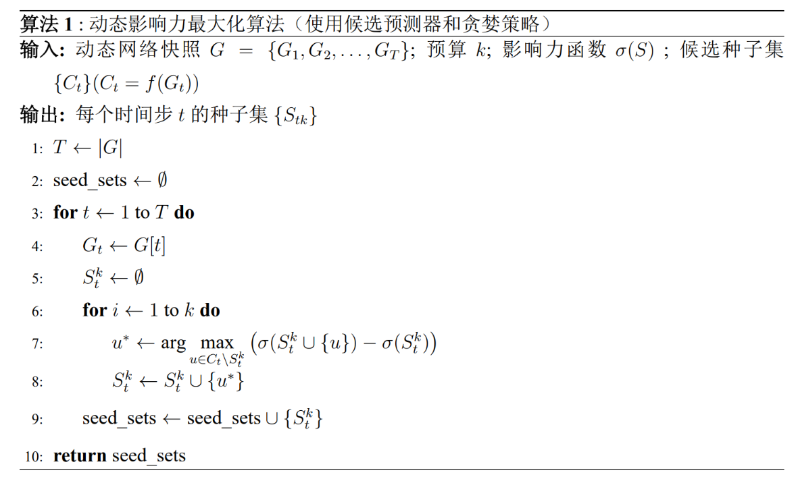
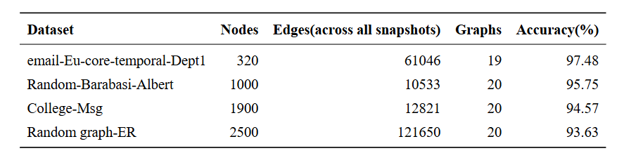
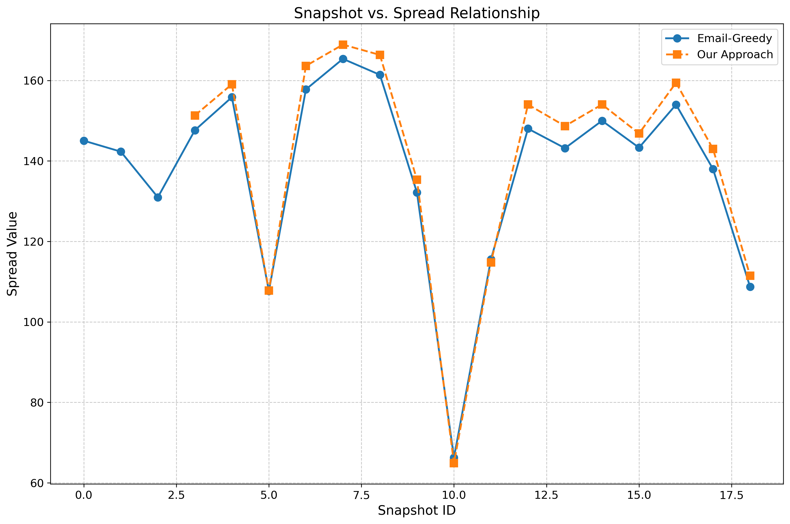
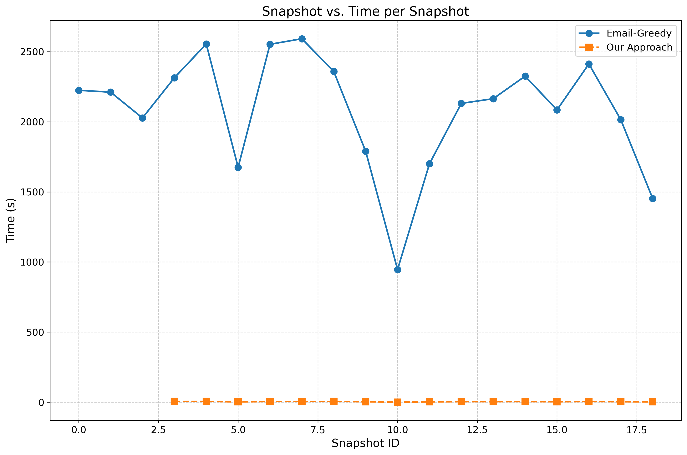

# 基于智慧家庭多维信息的动态社交网络快照分析及种子节点预测方法

## 技术领域

本发明涉及社交网络分析技术领域，具体涉及一种基于智慧家庭多维信息的动态社交网络快照分析及种子节点预测方法。

## 背景技术

影响力最大化（Influence Maximization, IM）是网络科学与数据挖掘领域的关键问题，旨在网络中选择少量“种子”节点以最大化信息传播范围。现有算法多为静态网络设计，部分基于图神经网络的方法虽能处理简单演化，但难以应对真实世界的高度动态系统。在智慧家庭等新兴场景中，此局限性尤为突出。智慧家庭网络由大量异构物联网设备组成，其拓扑、节点状态及连接关系因用户交互与环境变化而持续高速演进。其核心挑战在于，网络演化由多维信息感知驱动：节点的属性及节点间的影响力不再是静态标量，而是由位置、设备工况、网络带宽等多维实时信息动态决定的复杂状态。现有方法无法有效建模这种由多维信息感知驱动的复杂动态性，导致在执行如指令下发、安全预警等任务时，种子选择策略的准确性和时效性大打折扣。因此，急需一种能融合多维感知信息、并能适应高度动态网络的全新影响力最大化技术，以解决当前面临的挑战。

## 发明内容

为了克服传统影响力最大化算法在动态网络下的局限性，本发明提供了一种有效的动态网络快照分析技术和候选种子节点预测方法，通过动态社交网络快照分析技术和时空神经网络模型实现精准的候选种子节点预测。该方法首先采用一种自适应快照分析技术对社交网络进行动态建模，使用高效的动态启发式（TIFC）方法为节点预训练标签，通过 `DynGNN-AttLSTM` 模型提取节点的空间特征和时序特征，并基于正余弦位置编码为时空特征添加位置信息。随后，设计一个多头时间注意力机制模块捕获节点在动态网络中的长期影响力状态；最后，节点的多尺度时空特征经过层归一化和 FFN 处理完成特征融合后被送入分类器，从而预测出动态社交网络中的候选种子节点。

本发明克服其技术问题所采用的技术方案是：

### 1. 一种基于智慧家庭多维信息的动态社交网络快照分析及种子节点预测方法

包括如下步骤：

#### a）构建时序快照生成器

将动态社交网络数据集 $[SRC, TGT, TS]$ 输入到自适应快照生成器中，基于事件数阈值与时间长度约束进行窗口划分。若窗口内累计事件数 $N_{\text{events}}(t_s, t_i)$ 大于目标事件阈值 $\theta_{\text{events}}$ 且 $\Delta t \geq d_{\min}$，或 $\Delta t > d_{\max}$ 时触发切窗，生成动态网络序列 $G_1, G_2, G_3, \ldots, G_t$。

#### b）使用动态启发式 TIFC 方法进行预训练标注

计算动态网络序列 $G_1, G_2, G_3, \ldots, G_n$ 中节点的 TIFC 分数和空间特征 $[F_s^1, F_s^2, F_s^3, F_s^4, F_s^5, F_s^6, F_s^7, F_s^8, F_s^9]$，将得分前 $\tau\%$ 的节点 $s_1, s_2, s_3, \ldots, s_k$ 标记为有影响力的节点。

#### c）构建 DynGNN-AttLSTM 网络

加载快照序列，对时间窗口内所有快照的特征 $[F_s^1, F_s^2, F_s^3, F_s^4, F_s^5, F_s^6, F_s^7, F_s^8, F_s^9]$ 进行堆叠，利用 LSTM 层提取节点时序信息，并使用正余弦时间编码为快照添加位置信息，得到融合了空间结构、时序依赖和时间位置的特征向量。

#### d）构建时空交叉注意力融合模块

将提取的融合特征向量 $V$ 经过残差连接、层归一化、FFN 进一步提炼特征，得到最终融合特征 $F$。

#### e）构建候选种子节点分类器

将增强后的时序特征 $F$ 输入分类器，输出二分类的 logits，从而预测出每张快照中的候选种子节点。

#### f）通过贪心算法选择出包含 $k$ 个种子的集合 $S_k$。

---

### 2. 步骤 a）的具体实现

包括如下子步骤：

#### a-1）时序快照生成器组成

包含数据处理模块、窗口切分模块（可选自适应模式和固定模式）、时间衰减模块（可选加权模式和二进制模式，扩散模拟支持边权）。

#### a-2）数据预处理

读取输入文件 $[SRC, TGT, TS]$（含源节点、目标节点、时间戳），转换为结构化数据。将时间戳（秒级）转换为标准日期时间格式。

#### a-3）自适应窗口划分

设窗口起始时间为 $t_s$，当前事件索引为 $i$，当满足以下任一条件时触发切窗：

$$
\begin{cases}
N_{\text{events}}(t_s, t_i) \geq \theta_{\text{events}}, & \text{且 } \Delta t \geq d_{\min} \\
\Delta t > d_{\max}
\end{cases}
$$

其中：
- $N_{\text{events}}(t_s, t_i)$：窗口内累计事件数；
- $\theta_{\text{events}}$：目标事件阈值；
- $d_{\min}, d_{\max}$：最小和最大允许天数。

#### a-4）节点编号归一化

计算源节点与目标节点的最小编号，对所有节点编号进行偏移修正，使编号从 0 开始连续递增。

#### a-5）构建动态网络序列

保存为快照格式文件。

---

### 3. 步骤 b）的具体实现

#### b-1）TIFC 计算模块组成

包括数据加载模块、TIFC 计算模块（动态局部影响力、动态全局影响力、动态边传播概率的时间平滑度）、特征计算模块和标签生成模块。

#### b-2）数据加载

载入动态网络快照序列 $\{G_t = (V_t, E_t, W_t)\}_{t=1}^T$，其中：

- $V_t$：节点集合；
- $E_t \subseteq V_t \times V_t$：有向或无向边集合；
- $W_t = \{w_{uv}(t) \mid (u,v) \in E_t\}$：边权（交互强度），无权网络默认 $w_{uv}(t) = 1$；
- $N_t(u)$：节点 $u$ 在 $t$ 时刻的一阶邻居集合；
- $D_t(u) = |N_t(u)|$：度；
- $k_{c,t}(u)$：$t$ 时刻的 k-core coreness。

定义传播概率：

$$
P_t(u,v) := w_{uv}(t) \left(1 - p_s(v,t)\right)
$$

其中 $p_s(v,t) \in [0,1]$ 为节点 $v$ 的自激活概率，未知时默认为 0。

#### b-3）动态边传播概率的时间平滑度

采用指数加权移动平均（EWMA）：

$$
\widetilde{P}_t(u,v) = \beta \widetilde{P}_{t-1}(u,v) + (1 - \beta) P_t(u,v), \quad \beta \in [0,1)
$$

首帧初始化 $\widetilde{P}_1 = P_1$。对不存在的历史边设 $\widetilde{P}_{t-1} = 0$。

#### b-4）动态局部影响力

采用两跳截断并保留 Top-L 最强邻居（按 $\widetilde{P}_t(u,\cdot)$ 排序）：

$$
I_L^{\mathrm{dyn}}(u,t) = 1 + \sum_{v \in N_t^{(L)}(u)} \widetilde{P}_t(u,v) + \sum_{v \in N_t^{(L)}(u)} \sum_{z \in N_t^{(L)}(v)} \widetilde{P}_t(u,v) \widetilde{P}_t(v,z)
$$

其中 $N_t^{(L)}(x)$ 表示按 $\widetilde{P}_t(x,\cdot)$ 取前 $L$ 个邻居。

#### b-5）动态全局影响力

对度与 coreness 进行时间平滑：

$$
\overline{D}_t(u) = \rho \overline{D}_{t-1}(u) + (1 - \rho) D_t(u), \quad
\overline{k}_{c,t}(u) = \rho \overline{k}_{c,t-1}(u) + (1 - \rho) k_{c,t}(u), \quad \rho \in [0,1)
$$

定义新邻居率：

$$
\nu_t(u) = \frac{|N_t(u) \setminus N_{t-1}(u)|}{D_t(u) + \varepsilon}, \quad \varepsilon > 0
$$

则全局影响力为：

$$
I_G^{\mathrm{dyn}}(u,t) = \overline{k}_{c,t}(u) \left(1 + \frac{\overline{D}_t(u)}{D_{N,t}}\right) \left(1 + \eta \nu_t(u)\right), \quad D_{N,t} = \max_{x \in V_t} D_t(x),\ \eta \in [0,1]
$$

#### b-6）TIFC 综合得分与归一化

对局部项与全局项分别做帧内最大值归一化，并乘性融合：

$$
I^{\mathrm{dyn}}(u,t) = \frac{I_L^{\mathrm{dyn}}(u,t)}{\max_{x \in V_t} I_L^{\mathrm{dyn}}(x,t)} \cdot \frac{I_G^{\mathrm{dyn}}(u,t)}{\max_{x \in V_t} I_G^{\mathrm{dyn}}(x,t)} \cdot R_t(u)
$$

#### b-7）特征计算模块

为每个节点计算 9 个特征：

| 类型 | 特征名称 | 公式 |
|------|--------|------|
| 静态 | 度数 | $ \deg(v) = |\{ u \mid (u,v) \in E \}| $ |
| 静态 | 介数中心性 | $ C_B(v) = \sum_{s \neq v \neq t} \frac{\sigma_{st}(v)}{\sigma_{st}} $ |
| 静态 | k-核数 | $ k\_\text{core}(v) = \max\{k \mid v \in k\text{-core}\} $ |
| 静态 | 平均邻居度 | $ \bar{k}(v) = \frac{1}{\deg(v)} \sum_{u \in N(v)} \deg(u) $ |
| 静态 | 动态 TIFC 分数 | 见 b-6） |
| 动态 | 度变化量 | $ \Delta \deg(u) = \deg_{\text{now}}(u) - \overline{D}_{\text{prev}}(u) $ |
| 动态 | IFC 变化量 | $ \Delta IC(u) = IC_{\text{now}}(u) - IC_{\text{prev}}(u) $ |
| 动态 | 新邻居比例 | $ \nu(u) = \frac{|\text{new\_neighbors}(u)|}{\deg_{\text{now}}(u) + 10^{-9}} $ |
| 动态 | TIFC 波动系数 | $ \text{ic\_var}(u) = \text{Var}(IC_{t-h}(u), \ldots, IC_t(u)) $ |

> 注：$h$ 为历史窗口大小。

#### b-8）标签生成

对每个快照 $t$，将 $I^{\mathrm{dyn}}(\cdot,t)$ 降序排序，取前 $\tau\%$ 节点标记为 1，其余为 0。

---

### 4. 步骤 c）的具体实现

#### c-1）DynGNN-AttLSTM 网络结构

由 GraphSAGE 模块和 EnhancedBiLSTM 模块构成，后者包含 BiLSTM 时序提取模块和时间位置编码模块。

#### c-2）GraphSAGE 提取空间特征

输入快照序列 $G_1, G_2, \ldots, G_t$，在时间窗口内逐帧处理：

- 提取图结构 $g$ 和节点特征 $[F_s^1, \ldots, F_s^9]$；
- 第一层 SAGEConv 使用 pool 聚合器聚合邻居特征，经线性变换 + ReLU（Dropout=0.1）；
- 第二层 SAGEConv 输出 `spatial_features`，维度 `[B, N, gnn_hidden]`；
- 堆叠所有时间步的空间特征，得到 `[B, N, temporal_window, gnn_hidden]`。

#### c-3）EnhancedBiLSTM 提取时序特征

将空间特征重塑为 `[B*N, temporal_window, gnn_hidden]` 输入 BiLSTM：

- 两层 LSTM 捕捉时间依赖，输出基础时序特征 `[B*N, temporal_window, output_size]`；
- 加入正余弦位置编码（sin/cos 生成），得到增强特征 $x \in \mathbb{R}^{[B*N, \text{seq\_len}, \text{hidden\_size}]}$。

---

### 5. 步骤 d）的具体实现

#### d-1）权重计算模块

输入时序特征 $x \in \mathbb{R}^{[B, \text{seq\_len}, \text{hidden\_size}]}$，计算各时间步间“关联强度”，生成注意力权重矩阵 $A \in \mathbb{R}^{[B, \text{num\_heads}, \text{seq\_len}, \text{seq\_len}]}$。

#### d-2）加权融合模块

根据权重对特征加权求和，突出关键时间步（如突发动态），抑制平稳期。

#### d-3）特征优化模块

执行：
- 残差连接：$\text{out} = x + \text{attn\_output}$
- 层归一化
- 前馈网络（FFN）：两层全连接 + 激活函数

输出优化后特征 $F \in \mathbb{R}^{[B, \text{seq\_len}, \text{hidden\_size}]}$。

---

### 6. 步骤 e）的具体实现

#### e-1）分类器结构

由两层全连接网络构成，负责将融合特征转化为二分类结果。

#### e-2）第一层 FC

输入：`[B, N, temporal_output_size]`  
输出：维度 64，ReLU 激活，Dropout=0.1

#### e-3）第二层 FC

输出原始 logits（未归一化分数），用于后续 softmax 分类。

---

### 7. 步骤 f）的具体实现

#### f-1）预测候选种子集

使用训练好的 `DynGNN-AttLSTM` 模型预测每个快照的候选种子集 $C_t$。

#### f-2）贪心选择最优 $k$ 个种子

从候选集中选择影响力最大的 $k$ 个节点。

#### f-3）伪代码

---

### 8. 损失函数设计（步骤 g）

#### g-1）优化目标

设计三类损失函数：分类损失、排序损失、总损失。

#### g-2）分类损失（交叉熵）

$$
\mathcal{L}_{\text{cls}} = -\frac{1}{N} \sum_{i=1}^{N} \sum_{c=0}^{1} y_{i,c} \cdot \log\left( \text{softmax}(z_{i,c}) \right)
$$

其中：
- $N = \text{batch\_size} \times \text{num\_nodes}$
- $y_{i,c}$：真实标签
- $z_{i,c}$：原始 logits
- $\text{softmax}(z_{i,c}) = \frac{e^{z_{i,c}}}{\sum_{c'=0}^{1} e^{z_{i,c'}}}$

#### g-3）排序损失（Pairwise Logistic）

$$
\mathcal{L}_{\text{rank}} = \frac{1}{K} \sum_{j=1}^{K} \log\left( 1 + e^{-(s_{\text{pos},j} - s_{\text{neg},j})} \right)
$$

其中：
- $K = \min(\text{正样本数}, \text{负样本数})$
- $s_{\text{pos},j} = \text{softmax}(z_{\text{pos},j,1})$
- $s_{\text{neg},j} = \text{softmax}(z_{\text{neg},j,1})$

#### g-4）总损失

$$
\mathcal{L}_{\text{total}} = \mathcal{L}_{\text{cls}} + \lambda \cdot \mathcal{L}_{\text{rank}}
$$

其中 $\lambda$ 为排序损失权重系数。

---

## 本发明的有益效果

使用自适应快照分析技术对动态社交网络进行建模，结合 TIFC 启发式标注，通过 `DynGNN-AttLSTM` 和时间交叉注意力机制提取多尺度时空特征，最终预测候选种子节点。该方法有效捕获了节点的长期/短期、局部/全局影响力及动态联系，并引入排序损失提升预测合理性。

---

## 实验验证

在真实数据集 `CollegeMsg`、`email-Eu-core-temporal-Dept1` 及合成数据集 `Random-Barabasi-Albert`、`Random graph-ER` 上进行实验，评估指标包括：

- 预测准确率（Accuracy）
- 传播范围（Influence Spread）
- 耗费时间（Time）

结果如下：

### 表 1. 四个数据集上的预测准确率

## 附图说明

- **图 1**：本发明的方法流程图  
  

- **图 2**：本发明与 Greedy 方法在相同社交网络上的影响力传播范围对比  
  

- **图 3**：本发明与 Greedy 方法在相同社交网络上耗费时间对比  
  